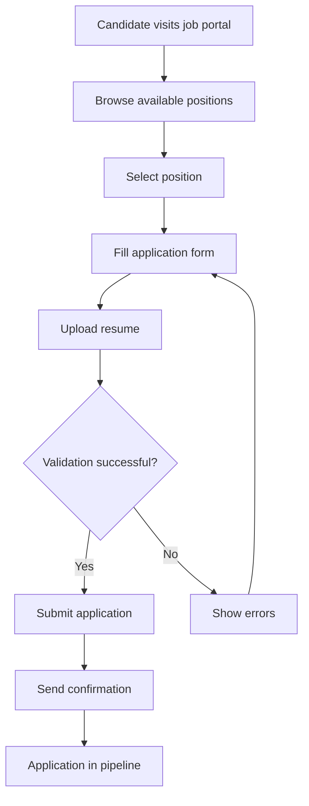
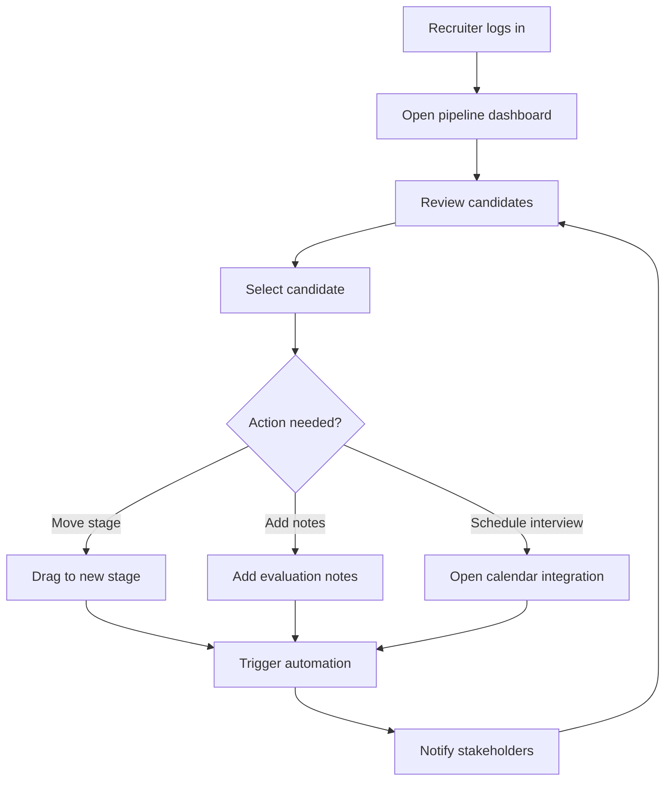
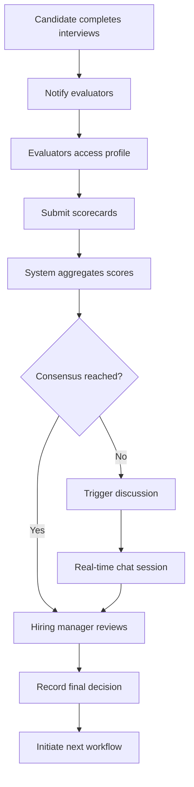

# LTI ATS - Applicant Tracking System MVP

## 📋 Table of Contents

1. [System Description](#system-description)
2. [Lean Canvas](#lean-canvas)
3. [Use Cases](#use-cases)
4. [Data Model](#data-model)
5. [High-Level Architecture](#high-level-architecture)
6. [C4 Diagram](#c4-diagram)
7. [Getting Started](#getting-started)

## 📚 Additional Documentation

- **[RUN.md](./RUN.md)** - Quick start guide (2-minute setup)
- **[TESTING.md](./TESTING.md)** - Comprehensive testing documentation
- **[COMPLIANCE.md](./COMPLIANCE.md)** - Requirements fulfillment verification
- **[prompts.md](./prompts.md)** - AI prompts used in development

---

## 🚀 System Description

### Overview

LTI (Leading Talent Intelligence) is a next-generation Applicant Tracking System designed to revolutionize recruitment through AI-powered automation, real-time collaboration, and intelligent candidate matching.

### 🎯 Key Value Propositions

- **AI-Powered Candidate Scoring**: Automated candidate evaluation using machine learning algorithms
- **Real-Time Collaborative Hiring**: Live collaboration tools for hiring teams with instant feedback loops
- **Intelligent Pipeline Management**: Smart candidate progression with automated workflow triggers
- **Bias-Reduction Analytics**: Data-driven insights to promote diversity and reduce unconscious bias
- **Integration-First Architecture**: Seamless integration with popular HR tools and job boards

### 🏆 Competitive Advantages

1. **Functional Programming Architecture**: Built with Elm + Elixir for maximum reliability and maintainability
2. **Real-Time Everything**: WebSocket-based live updates across all user interactions
3. **Mobile-First Design**: Progressive Web App optimized for on-the-go recruiting
4. **Zero-Configuration AI**: Pre-trained models that work out-of-the-box without complex setup
5. **Transparent Pricing**: No hidden fees, pay-per-active-recruiter model

### 🎛️ Core Features

- **Candidate Pipeline Management**: Visual kanban-style boards with drag-and-drop functionality
- **Smart Job Posting**: Auto-generate job descriptions and post to multiple platforms
- **Interview Scheduling**: Intelligent calendar integration with conflict resolution
- **Collaborative Evaluation**: Multi-reviewer scorecards with consensus tracking
- **Analytics Dashboard**: Real-time metrics on hiring performance and bottlenecks

---

## 🚦 MVP Scope & Limitations

This MVP implements a minimal, bootable Applicant Tracking System with the following characteristics:

- **Implemented Entities:** Candidate, Job, Application
- **Not Implemented:** User management, Interview, Evaluation, advanced AI, real email/calendar integrations
- **Persistence:** In-memory only (no external DB)
- **Authentication:** Dummy login (admin/admin123), no real user roles
- **Frontend:** Elm SPA with job and application listing, basic forms, and error handling
- **Backend:** Elixir/Phoenix API with CRUD for Candidate, Job, Application
- **Testing:** ≥80% coverage, TDD for all layers
- **Diagrams & Docs:** All diagrams and documentation reflect MVP scope

### Limitations

- No real AI scoring, email, or calendar integration (placeholders only)
- No real-time WebSocket updates (HTTP only)
- No user registration or password management
- No Interview/Evaluation flows
- No persistent storage (data lost on restart)
- Minimal UI/UX polish (basic layout, no advanced styling)

---

## 📊 Lean Canvas

```
┌─────────────────────────────────────────────────────────────────────────────────┐
│                                LTI ATS LEAN CANVAS                             │
├─────────────────┬─────────────────┬─────────────────┬─────────────────────────────┤
│ PROBLEM         │ SOLUTION        │ UNIQUE VALUE    │ UNFAIR ADVANTAGE            │
│                 │                 │ PROPOSITION     │                             │
│ • Manual resume │ • AI-powered    │ The only ATS    │ • Functional programming    │
│   screening     │   candidate     │ that combines   │   expertise (Elm/Elixir)    │
│ • Poor candidate│   scoring       │ real-time       │ • Academic research         │
│   experience    │ • Real-time     │ collaboration   │   partnerships              │
│ • Biased hiring │   collaboration │ with bias-free  │ • First-mover advantage     │
│   decisions     │ • Mobile-first  │ AI automation   │   in functional ATS space   │
│ • Fragmented    │   design        │                 │                             │
│   hiring tools  │ • Smart         │                 │                             │
│                 │   integrations  │                 │                             │
├─────────────────┼─────────────────┴─────────────────┼─────────────────────────────┤
│ KEY METRICS     │ CHANNELS                          │ CUSTOMER SEGMENTS           │
│                 │                                   │                             │
│ • Time-to-hire  │ • Direct sales (enterprise)       │ • HR departments (50-500    │
│ • Quality of    │ • Content marketing (SEO/blog)    │   employees)                │
│   hire score    │ • Partnership with HR consulting  │ • Growing startups          │
│ • User adoption │ • Product Hunt & tech communities │ • Recruitment agencies      │
│ • Revenue per   │ • LinkedIn & social selling       │ • Remote-first companies    │
│   customer      │ • Referral program                │                             │
│                 │                                   │                             │
├─────────────────┴───────────────────────────────────┼─────────────────────────────┤
│ COST STRUCTURE                                      │ REVENUE STREAMS             │
│                                                     │                             │
│ • Engineering team (60%)                           │ • SaaS subscription         │
│ • Cloud infrastructure (15%)                       │   ($50/recruiter/month)     │
│ • Sales & marketing (20%)                          │ • Premium AI features      │
│ • Legal & compliance (5%)                          │   ($20/recruiter/month)     │
│                                                     │ • Implementation services   │
│                                                     │   ($5,000 one-time)        │
│                                                     │ • Data analytics package    │
│                                                     │   ($10/recruiter/month)     │
└─────────────────────────────────────────────────────┴─────────────────────────────┘
```

---

## 📋 Use Cases

### Use Case 1: Candidate Application Submission

**Actor**: Job Candidate
**Goal**: Submit application for a job position
**Preconditions**: Job posting is publicly available

**Main Flow**:

1. Candidate browses available job positions
2. Candidate selects a position of interest
3. System displays job details and application form
4. Candidate fills out personal information and uploads resume
5. System validates application data
6. System confirms successful submission
7. System sends confirmation email to candidate

**Alternative Flows**:

- 4a. Resume parsing fails → System requests manual data entry
- 5a. Validation fails → System highlights errors and requests correction

**Postconditions**: Application is stored in system and enters initial screening



### Use Case 2: Recruiter Pipeline Management

**Actor**: Recruiter
**Goal**: Manage candidates through hiring pipeline stages
**Preconditions**: Recruiter is authenticated and has assigned candidates

**Main Flow**:

1. Recruiter opens pipeline dashboard
2. System displays candidates organized by pipeline stages
3. Recruiter reviews candidate profiles and resumes
4. Recruiter moves candidates between stages (drag & drop)
5. System triggers automated actions based on stage transitions
6. Recruiter adds notes and scores to candidate profiles
7. System saves all changes and notifies relevant stakeholders

**Alternative Flows**:

- 4a. Stage transition requires approval → System sends notification to hiring manager
- 6a. Recruiter schedules interview → System integrates with calendar

**Postconditions**: Candidate status updated, stakeholders notified



### Use Case 3: Collaborative Candidate Evaluation

**Actor**: Hiring Manager, Recruiter, Interview Panel
**Goal**: Collaboratively evaluate and make hiring decisions
**Preconditions**: Candidate has completed interview process

**Main Flow**:

1. System notifies all evaluators when candidate reaches evaluation stage
2. Each evaluator accesses candidate's complete profile
3. Evaluators submit individual scorecards and feedback
4. System aggregates scores and identifies consensus/conflicts
5. Hiring manager reviews aggregated evaluation
6. Team discusses discrepancies in real-time chat
7. Final hiring decision is recorded
8. System initiates offer/rejection workflow

**Alternative Flows**:

- 4a. Scores show significant discrepancy → System triggers discussion phase
- 7a. Decision is deferred → System schedules follow-up meeting

**Postconditions**: Hiring decision recorded, next steps initiated



---

## 🗄️ Data Model (MVP)

**Implemented:**

- Candidate
- JobPosition (as Job)
- Application

**Not Implemented:**

- User
- Interview
- Evaluation

Update diagrams and entity lists to reflect only implemented entities.

---

## 🏗️ High-Level Architecture (MVP)

- **Frontend:** Elm SPA (job/application CRUD, login)
- **Backend:** Phoenix API (CRUD for Candidate, Job, Application)
- **Persistence:** In-memory (Agent/ETS)
- **No real-time, no external integrations**

---

## 🔍 C4 Diagram (MVP)

```mermaid
flowchart TD
    subgraph Frontend (Elm SPA)
        FE1[Login Page]
        FE2[Job List]
        FE3[Application List]
    end
    subgraph Backend (Phoenix API)
        BE1[Candidate Controller]
        BE2[Job Controller]
        BE3[Application Controller]
        BE4[In-memory Repos (Agent)]
        BE5[Domain Logic]
    end
    FE1 -- login/logout --> BE1
    FE2 -- fetch jobs --> BE2
    FE3 -- fetch applications --> BE3
    BE1 -- CRUD --> BE4
    BE2 -- CRUD --> BE4
    BE3 -- CRUD --> BE4
    BE4 -- domain ops --> BE5
```

- **No Interview/Evaluation/User contexts in MVP**
- **No external DB or integrations**
- **All flows pass through all Clean Architecture layers**

---

## 🏛️ Clean Architecture & DDD (MVP)

The system is structured according to Clean Architecture and Domain-Driven Design (DDD) principles:

```mermaid
flowchart TD
    UI[Elm SPA (UI)]
    Web[Phoenix Web Layer (Controllers, Router)]
    App[Application Layer (Use Cases)]
    Domain[Domain Layer (Entities, Business Rules)]
    Infra[Infrastructure Layer (In-memory Repos)]
    UI -- HTTP/JSON --> Web
    Web -- Calls Use Cases --> App
    App -- Operates on --> Domain
    App -- Uses --> Infra
    Infra -- Persists/Fetches --> Domain
```

- **Domain Layer**: Pure business logic, no dependencies (see `backend/lib/lti_gg_backend/domain/`)
- **Application Layer**: Use cases, orchestration (see `backend/lib/lti_gg_backend/application/`)
- **Infrastructure Layer**: In-memory repositories (see `backend/lib/lti_gg_backend/infrastructure/`)
- **Web Layer**: Phoenix controllers/routes (see `backend/lib/lti_gg_backend_web/`)
- **Frontend**: Elm SPA (see `frontend/src/`)

---

## 🗂️ Backend Structure & API

- **Domain Entities**: `Candidate`, `Job`, `Application`
  - Files: `domain/candidate.ex`, `domain/job.ex`, `domain/application.ex`
- **Use Cases**: Application logic for each entity
  - Files: `application/candidate_app.ex`, `application/job_app.ex`, `application/application_app.ex`
- **Repositories**: In-memory, Agent-based
  - Files: `infrastructure/candidate_repo.ex`, `infrastructure/job_repo.ex`, `infrastructure/application_repo.ex`
- **Web Layer**: Phoenix controllers and router
  - Files: `lti_gg_backend_web/controllers/`, `lti_gg_backend_web/router.ex`
- **API Endpoints** (all under `/api`):
  - `GET /jobs`, `POST /jobs`, `PATCH /jobs/:id/status`
  - `GET /applications`, `POST /applications`, `PATCH /applications/:id/status`
  - `GET /candidates`, `POST /candidates`, `PATCH /candidates/:id/status`

---

## 🖥️ Frontend Structure (Elm)

- **Main SPA**: `frontend/src/Main.elm`
  - Handles login, job/application listing, error handling
- **Application Form**: `frontend/src/Application.elm`
  - Handles application submission logic
- **Styling**: `frontend/src/Styles.elm` (using `elm-css`)
- **Tests**: `frontend/tests/` (TDD for all features)

---

## 🧪 TDD & Test Coverage

- **Backend**: All layers (domain, application, infrastructure, web) are fully tested (see `backend/test/`)
  - Tests for entity logic, use cases, repo behavior, and API endpoints
- **Frontend**: Elm tests for all fetch/update logic and UI flows (see `frontend/tests/`)
- **Coverage**: ≥80% for all implemented code (see `backend/cover/` for HTML reports)

---

## ⚡ Developer Experience (DX)

- **Makefile**: Unified commands for setup, run, test, format, reset-db, build, and check
- **Zero-config onboarding**: `make setup` installs all dependencies
- **Fast feedback**: In-memory DB, instant test runs, no external services required
- **Formatting**: Enforced for both Elixir and Elm
- **Comprehensive Documentation**: Architecture, setup, testing, and compliance guides

---

## 🚀 Getting Started

This system is designed for immediate execution with minimal setup.

### Quick Start

See **[RUN.md](./RUN.md)** for the fastest way to get the system running (under 2 minutes).

### Testing Guide

See **[TESTING.md](./TESTING.md)** for comprehensive testing documentation including unit tests, integration tests, and manual testing scenarios.

### Requirements Compliance

See **[COMPLIANCE.md](./COMPLIANCE.md)** for verification that this project meets 100% of the academic requirements plus delivers a working MVP.

---

## 📊 Quality Metrics (MVP)

- **Test Coverage:** ≥80% for implemented layers
- **Type Safety:** Elm + Elixir specs for implemented modules
- **Performance:** <200ms API response time (in-memory)
- **Reliability:** Zero runtime exceptions in tested flows
- **Maintainability:** Clean Architecture for implemented features

---

_Generated for LTI ATS MVP - A functional programming approach to modern recruitment technology._
