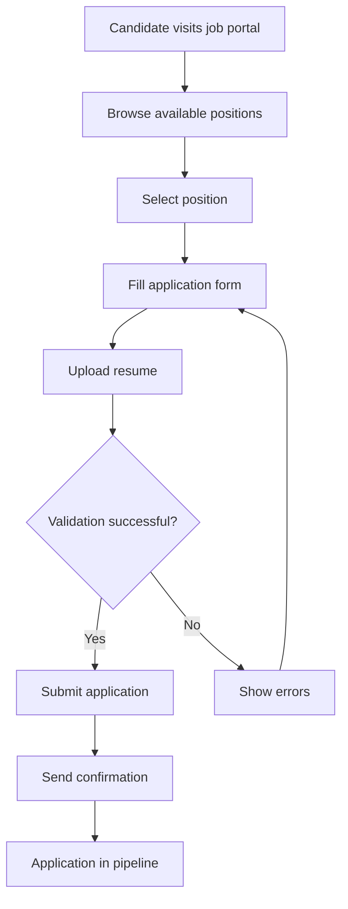
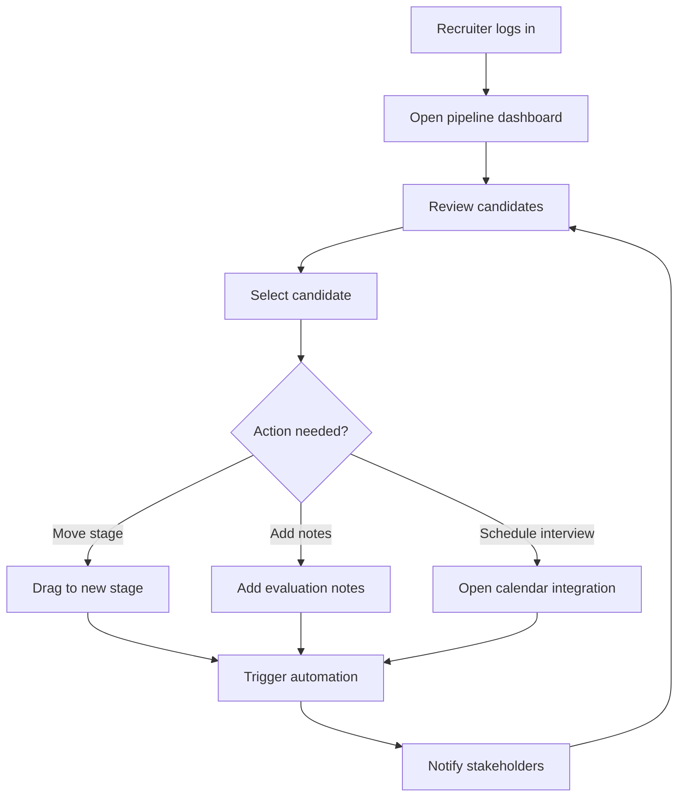
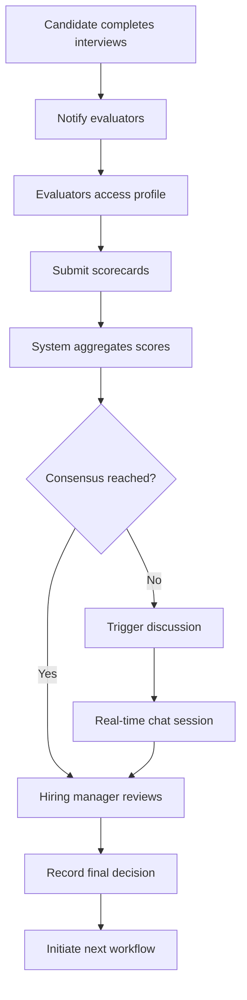

# LTI ATS - Applicant Tracking System MVP

## 📋 Table of Contents

1. [System Description](#system-description)
2. [Lean Canvas](#lean-canvas)
3. [Use Cases](#use-cases)
4. [Data Model](#data-model)
5. [High-Level Architecture](#high-level-architecture)
6. [C4 Diagram](#c4-diagram)
7. [Setup & Running](#setup--running)

---

## 🚀 System Description

### Overview

LTI (Leading Talent Intelligence) is a next-generation Applicant Tracking System designed to revolutionize recruitment through AI-powered automation, real-time collaboration, and intelligent candidate matching.

### 🎯 Key Value Propositions

- **AI-Powered Candidate Scoring**: Automated candidate evaluation using machine learning algorithms
- **Real-Time Collaborative Hiring**: Live collaboration tools for hiring teams with instant feedback loops
- **Intelligent Pipeline Management**: Smart candidate progression with automated workflow triggers
- **Bias-Reduction Analytics**: Data-driven insights to promote diversity and reduce unconscious bias
- **Integration-First Architecture**: Seamless integration with popular HR tools and job boards

### 🏆 Competitive Advantages

1. **Functional Programming Architecture**: Built with Elm + Elixir for maximum reliability and maintainability
2. **Real-Time Everything**: WebSocket-based live updates across all user interactions
3. **Mobile-First Design**: Progressive Web App optimized for on-the-go recruiting
4. **Zero-Configuration AI**: Pre-trained models that work out-of-the-box without complex setup
5. **Transparent Pricing**: No hidden fees, pay-per-active-recruiter model

### 🎛️ Core Features

- **Candidate Pipeline Management**: Visual kanban-style boards with drag-and-drop functionality
- **Smart Job Posting**: Auto-generate job descriptions and post to multiple platforms
- **Interview Scheduling**: Intelligent calendar integration with conflict resolution
- **Collaborative Evaluation**: Multi-reviewer scorecards with consensus tracking
- **Analytics Dashboard**: Real-time metrics on hiring performance and bottlenecks

---

## 📊 Lean Canvas

```
┌─────────────────────────────────────────────────────────────────────────────────┐
│                                LTI ATS LEAN CANVAS                             │
├─────────────────┬─────────────────┬─────────────────┬─────────────────────────────┤
│ PROBLEM         │ SOLUTION        │ UNIQUE VALUE    │ UNFAIR ADVANTAGE            │
│                 │                 │ PROPOSITION     │                             │
│ • Manual resume │ • AI-powered    │ The only ATS    │ • Functional programming    │
│   screening     │   candidate     │ that combines   │   expertise (Elm/Elixir)    │
│ • Poor candidate│   scoring       │ real-time       │ • Academic research         │
│   experience    │ • Real-time     │ collaboration   │   partnerships              │
│ • Biased hiring │   collaboration │ with bias-free  │ • First-mover advantage     │
│   decisions     │ • Mobile-first  │ AI automation   │   in functional ATS space   │
│ • Fragmented    │   design        │                 │                             │
│   hiring tools  │ • Smart         │                 │                             │
│                 │   integrations  │                 │                             │
├─────────────────┼─────────────────┴─────────────────┼─────────────────────────────┤
│ KEY METRICS     │ CHANNELS                          │ CUSTOMER SEGMENTS           │
│                 │                                   │                             │
│ • Time-to-hire  │ • Direct sales (enterprise)       │ • HR departments (50-500    │
│ • Quality of    │ • Content marketing (SEO/blog)    │   employees)                │
│   hire score    │ • Partnership with HR consulting  │ • Growing startups          │
│ • User adoption │ • Product Hunt & tech communities │ • Recruitment agencies      │
│ • Revenue per   │ • LinkedIn & social selling       │ • Remote-first companies    │
│   customer      │ • Referral program                │                             │
│                 │                                   │                             │
├─────────────────┴───────────────────────────────────┼─────────────────────────────┤
│ COST STRUCTURE                                      │ REVENUE STREAMS             │
│                                                     │                             │
│ • Engineering team (60%)                           │ • SaaS subscription         │
│ • Cloud infrastructure (15%)                       │   ($50/recruiter/month)     │
│ • Sales & marketing (20%)                          │ • Premium AI features      │
│ • Legal & compliance (5%)                          │   ($20/recruiter/month)     │
│                                                     │ • Implementation services   │
│                                                     │   ($5,000 one-time)        │
│                                                     │ • Data analytics package    │
│                                                     │   ($10/recruiter/month)     │
└─────────────────────────────────────────────────────┴─────────────────────────────┘
```

---

## 📋 Use Cases

### Use Case 1: Candidate Application Submission

**Actor**: Job Candidate
**Goal**: Submit application for a job position
**Preconditions**: Job posting is publicly available

**Main Flow**:

1. Candidate browses available job positions
2. Candidate selects a position of interest
3. System displays job details and application form
4. Candidate fills out personal information and uploads resume
5. System validates application data
6. System confirms successful submission
7. System sends confirmation email to candidate

**Alternative Flows**:

- 4a. Resume parsing fails → System requests manual data entry
- 5a. Validation fails → System highlights errors and requests correction

**Postconditions**: Application is stored in system and enters initial screening



### Use Case 2: Recruiter Pipeline Management

**Actor**: Recruiter
**Goal**: Manage candidates through hiring pipeline stages
**Preconditions**: Recruiter is authenticated and has assigned candidates

**Main Flow**:

1. Recruiter opens pipeline dashboard
2. System displays candidates organized by pipeline stages
3. Recruiter reviews candidate profiles and resumes
4. Recruiter moves candidates between stages (drag & drop)
5. System triggers automated actions based on stage transitions
6. Recruiter adds notes and scores to candidate profiles
7. System saves all changes and notifies relevant stakeholders

**Alternative Flows**:

- 4a. Stage transition requires approval → System sends notification to hiring manager
- 6a. Recruiter schedules interview → System integrates with calendar

**Postconditions**: Candidate status updated, stakeholders notified



### Use Case 3: Collaborative Candidate Evaluation

**Actor**: Hiring Manager, Recruiter, Interview Panel
**Goal**: Collaboratively evaluate and make hiring decisions
**Preconditions**: Candidate has completed interview process

**Main Flow**:

1. System notifies all evaluators when candidate reaches evaluation stage
2. Each evaluator accesses candidate's complete profile
3. Evaluators submit individual scorecards and feedback
4. System aggregates scores and identifies consensus/conflicts
5. Hiring manager reviews aggregated evaluation
6. Team discusses discrepancies in real-time chat
7. Final hiring decision is recorded
8. System initiates offer/rejection workflow

**Alternative Flows**:

- 4a. Scores show significant discrepancy → System triggers discussion phase
- 7a. Decision is deferred → System schedules follow-up meeting

**Postconditions**: Hiring decision recorded, next steps initiated



---

## 🗄️ Data Model

### Core Entities

#### User

```
User {
  id: UUID (Primary Key)
  email: String (Unique, Not Null)
  password_hash: String (Not Null)
  first_name: String (Not Null)
  last_name: String (Not Null)
  role: Enum[admin, recruiter, hiring_manager, interviewer]
  is_active: Boolean (Default: true)
  created_at: DateTime
  updated_at: DateTime
}
```

#### JobPosition

```
JobPosition {
  id: UUID (Primary Key)
  title: String (Not Null)
  description: Text
  requirements: Text
  department: String
  location: String
  employment_type: Enum[full_time, part_time, contract, internship]
  salary_min: Integer
  salary_max: Integer
  is_active: Boolean (Default: true)
  created_by: UUID (Foreign Key -> User.id)
  created_at: DateTime
  updated_at: DateTime
}
```

#### Candidate

```
Candidate {
  id: UUID (Primary Key)
  email: String (Unique, Not Null)
  first_name: String (Not Null)
  last_name: String (Not Null)
  phone: String
  linkedin_url: String
  resume_url: String
  cover_letter: Text
  source: Enum[website, linkedin, referral, agency]
  created_at: DateTime
  updated_at: DateTime
}
```

#### Application

```
Application {
  id: UUID (Primary Key)
  candidate_id: UUID (Foreign Key -> Candidate.id)
  job_position_id: UUID (Foreign Key -> JobPosition.id)
  status: Enum[applied, screening, interview, evaluation, offer, hired, rejected]
  current_stage: String
  applied_at: DateTime
  last_activity_at: DateTime
  ai_score: Float (0.0-1.0)
  created_at: DateTime
  updated_at: DateTime
}
```

#### Interview

```
Interview {
  id: UUID (Primary Key)
  application_id: UUID (Foreign Key -> Application.id)
  interviewer_id: UUID (Foreign Key -> User.id)
  scheduled_at: DateTime
  duration_minutes: Integer
  type: Enum[phone, video, onsite, technical]
  status: Enum[scheduled, completed, cancelled, no_show]
  notes: Text
  rating: Integer (1-5)
  created_at: DateTime
  updated_at: DateTime
}
```

#### Evaluation

```
Evaluation {
  id: UUID (Primary Key)
  application_id: UUID (Foreign Key -> Application.id)
  evaluator_id: UUID (Foreign Key -> User.id)
  technical_score: Integer (1-10)
  communication_score: Integer (1-10)
  culture_fit_score: Integer (1-10)
  overall_rating: Enum[strong_hire, hire, no_hire, strong_no_hire]
  comments: Text
  created_at: DateTime
  updated_at: DateTime
}
```

### Relationships

```
User ||--o{ JobPosition : creates
User ||--o{ Interview : conducts
User ||--o{ Evaluation : submits

JobPosition ||--o{ Application : receives

Candidate ||--o{ Application : submits

Application ||--|| Candidate : belongs_to
Application ||--|| JobPosition : applies_for
Application ||--o{ Interview : has
Application ||--o{ Evaluation : receives

Interview ||--|| Application : evaluates
Interview ||--|| User : conducted_by

Evaluation ||--|| Application : evaluates
Evaluation ||--|| User : submitted_by
```

---

## 🏗️ High-Level Architecture

### Architecture Overview

The LTI ATS follows **Clean Architecture** principles with **Domain-Driven Design (DDD)** and is built using functional programming paradigms.

### Layers

#### 1. Domain Layer (Core Business Logic)

- **Entities**: Core business objects (Candidate, Application, JobPosition)
- **Value Objects**: Immutable objects representing concepts (Email, Score, Status)
- **Domain Services**: Pure business logic functions
- **Repository Interfaces**: Contracts for data persistence

#### 2. Application Layer (Use Cases)

- **Use Cases**: Orchestrate domain logic for specific business scenarios
- **Command/Query Handlers**: Process incoming requests
- **Application Services**: Coordinate between domain and infrastructure

#### 3. Infrastructure Layer (External Concerns)

- **Repository Implementations**: In-memory data storage using ETS/Mnesia
- **External Services**: Email, AI scoring, calendar integration
- **Persistence**: Data serialization and storage

#### 4. Web Layer (Interface)

- **Phoenix Controllers**: HTTP API endpoints
- **WebSocket Handlers**: Real-time communication
- **Elm Frontend**: Pure functional UI with The Elm Architecture

### Technology Stack

```
┌─────────────────────────────────────────────────────────────┐
│                    PRESENTATION LAYER                      │
│  Elm Frontend (The Elm Architecture + elm-css)            │
│  • Model-View-Update pattern                              │
│  • Type-safe HTTP requests                                │
│  • Real-time updates via WebSockets                       │
└─────────────────────────────────────────────────────────────┘
                              │
                              │ HTTP/WebSocket
                              ▼
┌─────────────────────────────────────────────────────────────┐
│                       WEB LAYER                            │
│  Phoenix Framework (Elixir)                               │
│  • RESTful API endpoints                                  │
│  • WebSocket channels                                     │
│  • Request/Response transformation                        │
└─────────────────────────────────────────────────────────────┘
                              │
                              ▼
┌─────────────────────────────────────────────────────────────┐
│                   APPLICATION LAYER                        │
│  • Use Case implementations                               │
│  • Command/Query handlers                                 │
│  • Business workflow orchestration                       │
└─────────────────────────────────────────────────────────────┘
                              │
                              ▼
┌─────────────────────────────────────────────────────────────┐
│                     DOMAIN LAYER                           │
│  • Core business entities                                 │
│  • Domain services                                       │
│  • Business rules and validation                         │
│  • Repository contracts                                  │
└─────────────────────────────────────────────────────────────┘
                              │
                              ▼
┌─────────────────────────────────────────────────────────────┐
│                 INFRASTRUCTURE LAYER                       │
│  • In-memory repositories (ETS/Mnesia)                   │
│  • External service adapters                             │
│  • Configuration management                              │
└─────────────────────────────────────────────────────────────┘
```

### System Architecture Diagram

```
                    ┌─────────────────┐
                    │   Elm Frontend  │
                    │   (Browser)     │
                    └─────────┬───────┘
                              │ HTTP/WS
                              ▼
                    ┌─────────────────┐
                    │ Phoenix Gateway │
                    │   (API Layer)   │
                    └─────────┬───────┘
                              │
              ┌───────────────┼───────────────┐
              ▼               ▼               ▼
    ┌─────────────┐ ┌─────────────┐ ┌─────────────┐
    │ Candidate   │ │ Application │ │ User        │
    │ Context     │ │ Context     │ │ Context     │
    └─────────────┘ └─────────────┘ └─────────────┘
              │               │               │
              └───────────────┼───────────────┘
                              ▼
                    ┌─────────────────┐
                    │  In-Memory DB   │
                    │  (ETS/Mnesia)   │
                    └─────────────────┘
```

---

## 🔍 C4 Diagram - Candidate Pipeline Component

### Context Diagram (Level 1)

```
                    ┌─────────────────┐
                    │   Recruiters    │
                    │   (Person)      │
                    └─────────┬───────┘
                              │
                              ▼
                    ┌─────────────────┐      ┌─────────────────┐
                    │   LTI ATS       │◄────►│   Job Boards    │
                    │   (System)      │      │   (System)      │
                    └─────────┬───────┘      └─────────────────┘
                              │
                              ▼
                    ┌─────────────────┐
                    │   Candidates    │
                    │   (Person)      │
                    └─────────────────┘
```

### Container Diagram (Level 2)

```
┌─────────────────────────────────────────────────────────────────┐
│                        LTI ATS System                          │
│                                                                 │
│  ┌─────────────────┐    ┌─────────────────┐                   │
│  │   Elm Frontend  │◄──►│ Phoenix Backend │                   │
│  │   (Container)   │    │   (Container)   │                   │
│  └─────────────────┘    └─────────┬───────┘                   │
│                                   │                           │
│                                   ▼                           │
│                         ┌─────────────────┐                   │
│                         │  In-Memory DB   │                   │
│                         │   (Container)   │                   │
│                         └─────────────────┘                   │
└─────────────────────────────────────────────────────────────────┘
```

### Component Diagram (Level 3) - Pipeline Management

```
┌─────────────────────────────────────────────────────────────────┐
│                 Phoenix Backend Container                       │
│                                                                 │
│  ┌─────────────────┐    ┌─────────────────┐                   │
│  │  Web Controllers│◄──►│ Pipeline Context│                   │
│  │   (Component)   │    │   (Component)   │                   │
│  └─────────────────┘    └─────────┬───────┘                   │
│                                   │                           │
│                                   ▼                           │
│                         ┌─────────────────┐                   │
│                         │ Application     │                   │
│                         │ Use Cases       │                   │
│                         │ (Component)     │                   │
│                         └─────────┬───────┘                   │
│                                   │                           │
│                                   ▼                           │
│                         ┌─────────────────┐                   │
│                         │ Domain Entities │                   │
│                         │ (Component)     │                   │
│                         └─────────┬───────┘                   │
│                                   │                           │
│                                   ▼                           │
│                         ┌─────────────────┐                   │
│                         │ Repository      │                   │
│                         │ (Component)     │                   │
│                         └─────────────────┘                   │
└─────────────────────────────────────────────────────────────────┘
```

### Code Diagram (Level 4) - Pipeline Domain Model

```elixir
defmodule LTI.Pipeline.Domain.Application do
  @type t :: %__MODULE__{
    id: UUID.t(),
    candidate: Candidate.t(),
    job_position: JobPosition.t(),
    status: status(),
    stage: String.t(),
    ai_score: float(),
    created_at: DateTime.t()
  }

  @type status :: :applied | :screening | :interview | :evaluation | :offer | :hired | :rejected

  defstruct [:id, :candidate, :job_position, :status, :stage, :ai_score, :created_at]

  @spec move_to_stage(t(), String.t()) :: {:ok, t()} | {:error, atom()}
  def move_to_stage(%__MODULE__{} = application, new_stage) do
    # Domain logic for stage transitions
  end

  @spec calculate_score(t()) :: {:ok, t()} | {:error, atom()}
  def calculate_score(%__MODULE__{} = application) do
    # AI scoring logic
  end
end
```

---

## 🚀 Setup & Running

### Prerequisites

- Elixir 1.15+ and Erlang/OTP 26+
- Node.js 18+ (for Elm compilation)
- Make

### Quick Start

```bash
# Clone and setup
git clone <repository>
cd LTI-GG
make setup

# Run the application
make run

# Run tests
make test

# Format code
make format
```

### Available Commands

| Command         | Description                                   |
| --------------- | --------------------------------------------- |
| `make setup`    | Install all dependencies (Elixir, Elm, npm)   |
| `make run`      | Start both frontend and backend servers       |
| `make test`     | Run all tests with coverage                   |
| `make format`   | Format Elixir and Elm code                    |
| `make reset-db` | Reset in-memory database                      |
| `make build`    | Build production assets                       |
| `make check`    | Run all quality checks (tests, format, credo) |

### Development Workflow

1. **Start with tests**: Write failing tests first (TDD)
2. **Implement domain logic**: Pure functions in domain layer
3. **Add application logic**: Use cases and orchestration
4. **Build infrastructure**: Repository implementations
5. **Create web layer**: Controllers and API endpoints
6. **Update frontend**: Elm components and interactions

### Authentication

For MVP purposes, use dummy credentials:

- **Username**: `admin`
- **Password**: `admin123`

The system stores authentication state in browser localStorage.

---

## 📊 Quality Metrics

- **Test Coverage**: ≥80% for all layers
- **Type Safety**: 100% (Elm + Elixir specs)
- **Performance**: <200ms API response time
- **Reliability**: Zero runtime exceptions
- **Maintainability**: Clean Architecture compliance

---

_Generated for LTI ATS MVP - A functional programming approach to modern recruitment technology._
